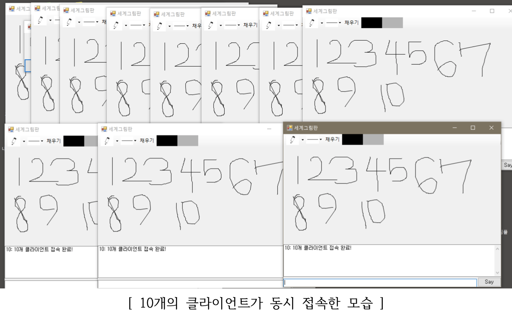

## Remote Multi-Access Paint (원격 다중 접속 그림판)

&nbsp;&nbsp;&nbsp;&nbsp;&nbsp;&nbsp;&nbsp;&nbsp;&nbsp;&nbsp;&nbsp;&nbsp;&nbsp;&nbsp;&nbsp;&nbsp;&nbsp;&nbsp;&nbsp;&nbsp;&nbsp;&nbsp;&nbsp;&nbsp;&nbsp;&nbsp;&nbsp;&nbsp;&nbsp;&nbsp;&nbsp;&nbsp;&nbsp;&nbsp;&nbsp;&nbsp;&nbsp;&nbsp;&nbsp;&nbsp;&nbsp;&nbsp;&nbsp;&nbsp;&nbsp;&nbsp;&nbsp;&nbsp;&nbsp;&nbsp;&nbsp;&nbsp;&nbsp;&nbsp;&nbsp;&nbsp;&nbsp;&nbsp;&nbsp;&nbsp;*2019-1 응용소프트웨어실습 프로젝트*

**다중 Socket 통신을 이용하여 그림 데이터를 공유해 동시에 여러 사용자가 그림을 그릴 수 있는 그림판 프로그램을 구현**

**더 자세한 내용은 report.pdf 파일을 확인해주세요**

 

- **구현한 기능 소개**
  - 서버-클라이언트 모델
  - 1:N Socket Communication
  - 그림판
  - 실시간 화면 공유 - 서버와 실시간 통신
  - 더블 버퍼링
  - 서버 정보 저장 - 서버를 재가동하여도 마지막 그림이 남아있음
  - 채팅

 

- **사용한 언어 및 도구, 라이브러리**
  + C#
  
  + Winform
  
     

+ **개발 환경**
  + Windows 10
  + Visual Studio

 

- **스크린샷**

  </img>

  

---

> 2019.11.5 최종 업데이트
>
> 광운대학교 소프트웨어학부 윤홍찬

